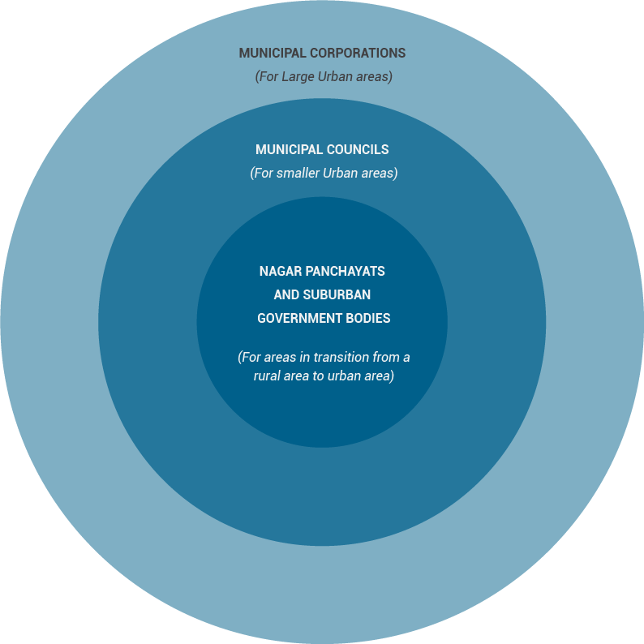
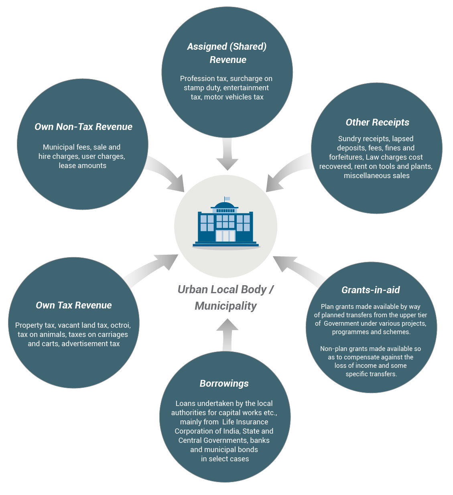

Municipal Corporation Budgets
=============================

What is an Urban Local Government?
----------------------------------

An Urban Local Government or a municipality is the layer of government which has the responsibility of development of cities and towns. The `74th Constitutional Amendment Act (CAA)`_, enacted in 1992, resulted in significant devolution of funds, functions and functionaries to this tier of government and hence functional autonomy of local governments. Following the passage of the 74th constitutional amendment which gave constitutional status to Urban Local Governments, various States created enabling legislation to transfer responsibilities of local infrastructure and service delivery to this tier of government. With the implementation of this Act, Urban Local Governments have been classified into three types of **Municipal** bodies:

.. _74th Constitutional Amendment Act (CAA): http://indiacode.nic.in/coiweb/amend/amend74.htm

Among the different types of Urban Local Governments mentioned above, Municipal Corporations enjoy the maximum degree of fiscal autonomy and functions although the specific fiscal and functional powers vary across the states.

What are the Functions of Municipalities?
-----------------------------------------

The Twelfth Schedule of the Constitution lists the various Functions of Municipalities. These are:

1. Urban planning including town planning.
2. Regulation of land-use and construction of buildings.
3. Planning for economic and social development.
4. Roads and bridges.
5. Water supply for domestic, industrial and commercial purposes.
6. Public health, sanitation conservancy and solid waste management.
7. Fire services.
8. Urban forestry, protection of the environment and promotion of ecological aspects.
9. Safeguarding the interests of weaker sections of society, including the handicapped and mentally retarded.
10. Slum improvement and upgradation.
11. Urban poverty alleviation.
12. Provision of urban amenities and facilities such as parks, gardens, playgrounds.
13. Promotion of cultural, educational and aesthetic aspects.
14. Burials and burial grounds; cremations, cremation grounds; and electric crematoriums.
15. Cattle pounds; prevention of cruelty to animals.
16. Vital statistics including registration of births and deaths.
17. Public amenities including street lighting, parking lots, bus stops and public conveniences.
18. Regulation of slaughter houses and tanneries.

Of these some functions are obligatory in nature and some others are discretionary. Further, there is a wide variance between States in terms of the assignment of overall functions and within that, obligatory and discretionary functions, to the municipalities. 

What Information does Municipality Budgets Provide?
---------------------------------------------------

Like all budget documents, budgets of Municipal Corporations/Councils is also a **policy document** which provides details of the local body’s **sources of income or receipts and use of these resources or expenditure allocated to different heads**. The expenditure heads, in turn, are determined by the various functions Municipalities are required to perform. 

What are the Sources of Receipts/Income of Municipalities?
----------------------------------------------------------

The major sources of receipts/income for the Urban Local Bodies are:

As is clear Muncipalities have different sources of income. Some of these such as tax and non-tax revenue are generated by these bodies themselves. But owing to rapid pace of urbanisation and the need for urban infrastructure development, own revenue generated by municipalities often falls short of their expenditure requirements. Thus, over and above their own revenue, most local bodies depend significantly upon the devolution of resources and grants from the State and Central governments; and borrowings from financial institutions. 

As per the Constitution, the Government of India has been making allocations to local bodies through five year plans and finance commissions (Central Finance Commissions, State Finance Commissions). Beginning from the First Five Year Plan allocations have been made to Urban Local Governments for various purposes. 

As regards the Central Finance Commissions, which primarily make recommendations on the distribution of tax revenues between the Union and the States, and also amongst the States, the Tenth Finance Commission introduced exclusive grants for rural and urban local governments. Since then various Finance Commissions have given concrete recommendations regarding municipal finances and the criteria for devolution of funds to Urban Local Bodies. 

Given below is a snapshot of revenue receipts and capital receipts (in this case, suspense accounts) of Kolkata Municipal Corporation for the financial year 2015-16:

**KOLKATA MUNICIPAL CORPORATION BUDGET EXTRACT (Borough I – XVI)**
Estimates of Revenue Receipt classified

I. REVENUE RECEIPT (INTERNAL SOURCE)

(A) TAX REVENUE

1. Property Tax including Surcharge on Property Tax
2. Tax on Trade, Profession & Calling
3. Tax on Advertisement
4. Service Charges on Central Govt. Properties
5. Tax on Carriages
6. Tax on Carts

Total Tax Revenue

(B) NON-TAX REVENUE

1. Receipt from Water Supply
2. Receipt from Sale of Water to Ships
3. Receipt from Sewerage & Drainage
4. Receipt from Municipal Markets
5. Receipt from Land & Estates
6. Receipt from Building Plan Sanction Fees
7. Receipt from License Fees
8. Receipt from Solid Waste Management
9. Receipt from Health Services
10. Receipt from Amusement Fees
11. Receipt from Car Parking Fees
12. Receipt from Advertisement Fees
13. Receipt from Roads, Parks & Squares
14. Receipt from Sale of Condemned Materials
15. Receipt from Interest on Fixed Deposit
16. Unclassified Receipts

Total Non-Tax Revenue

(C) Public Private Partnership

Total Revenue from Internal Sources (A + B + C)

II. Government Grant

1. Grants for Dearness Allowance
2. Grants for increased cost of pay
3. Grants out of the proceeds of M. V. Tax
4. Other Grants
5. Special Grant for C.E.S.C./WBSEDCL
6. Grant for supplementing services in Bustees/Slums A/C.
7. Grants for supplementing services to Water Supply, Sewerage & Drainage A/C.
8. Grants out of the proceeds of Entertainment Tax
9. Development Grant
10. Relief on Pension
11. Fixed Grant
12. Grant for pulse polio programme
13. Grant for Riverfront Beautification

Total Government Grant

TOTAL REVENUE RECEIPT (I + II)

**KOLKATA MUNICIPAL CORPORATION BUDGET EXTRACT (Borough I – XVI)**
Estimates of Receipt (Suspense Heads) classified

RECEIPT (SUSPENSE HEADS)

1. Basic Minimum Service
2. N.S.D.P.
3. K.E.I.P.
4. Special Development fund (KMDA)
5. Housing for Urban Poor
6. Shelter for shelter less people
7. Special Development Programme
8. Sarba Shiksha Mission
9. Rajiv Abas Yojana
10. Programme for installation of Water Meters
11. 11th Finance Commission
12. M.P. LAD Scheme
13. B.E.U.P.
14. Municipal Building Scheme
15. C.U.D.P.-III (Health)
16. Rashtriya Swasthya Bima Yojana
17. Urban Primary Health Care Services
18. SJSRY
19. Development of Municipal Area
20. Short/Medium Term Loan
21. Riverfront Development Project
22. Schemes under G.A.P.
23. N.S.A.P.
24. Modernisation of abattoir at Tangra
25. Modernisation of Goat Abattoir at Rabindra Sarani
26. Modernisation of Goat & Sheep Abattoir at DC Dey Road
27. Tolly’s Nallah Project
28. State Finance Commission
29. Miscellaneous Agencies
30. Wage Employment Scheme
31. Redevelopment of Municipal Market
32. J.N.N.U.R.M.
33. Stores Purchase
34. VAMBAY Works
35. Corpus Fund
36. Operation & Maintenance of East Kolkata Asset
37. Multi Sectoral Plan for Development of Minorities
38. Construction of IT Park
39. Disaster Risk Reduction Programme
40. 12th Finance Commission
41. 13th Finance Commission / Finance Commission
42. K.E.I.I.P.
43. Development of Refugee Colony

Total Receipt (Suspense Heads)

Total Revenue Receipt

Total Receipt (Revenue + Suspense)

RECEIPT (CONTRA HEADS) 

(A) Deposit & Advances to Corporation Employees
(B) Deposit & Advances to Contractors

TOTAL RECEIPT (CONTRA HEADS)

Where is the Money Spent by Municipalities?
-------------------------------------------

As mentioned earlier, Municipalities of India are vested with eighteen functions which are entrusted to them by the State governments. The expenditures of Urban Local Governments can be broadly summarised into the flowing categories:

**General Administration:** Municipal administration, finance, election, estate, etc. 

**Planning & Regulations** which includes city and town planning, building regulation, encroachment removal, trade license

**Public Works:** Construction and maintenance of roads and pavements, bridges and fly overs, street lighting, storm water drains, traffic signals, etc.

**Health:** Public health, epidemic / prevention control, family planning, primary health care, hospital services, burial and cremations, Ambulance / Hearse Services

**Sanitation and Solid Waste Management:** Solid Waste Management (SWM), public convenience, slaughter houses, etc. 

**Civic Amenities:** Water supply, sewerage, fire services, municipal markets, etc. 

**Urban Forestry:** Parks, gardens, play grounds, lakes and ponds, urban forestry, environment conservation, etc. 

**Urban Poverty Alleviation & Social Welfare:** Welfare of women, welfare of SC/ST/OBC, slum improvements, housing, urban poverty alleviation

**Other Services:** Electricity, education, transportation, facility for pilgrims

Given below is a snapshot of revenue expenditure of Belgaum Municipal Corporation for the financial year 2015-16:

**BELGAUM MUNICIPAL CORPORATION ESTIMATE OF REVENUE PAYMENTS FOR THE YEAR 2015-16**

* F-00-01-General Administration
* F-00-02-Legal Cell.
* F-00-04-I T Cell
* F-01-Council.
* F-03-01-Accounts and Finance
* F-03-02-Audit Wing
* F-11-Town Planning.
* F-20-Public Works General.
* F-21-Roads,Pavements, paths and road side
* F-24-Street Lighting.
* F-30- Health - General.
* F-35-Health - Medical.
* F-36-Burial and Cremation.
* F-41-Solid Waste Management
* F-50-Civic Amenities
* F-51-Water Supply.
* F-52-Sewerage.
* F-60-Urban Forestry.
* F-75-Urban Poverty Alleviation-Welfare of SC/ST 22.75%
* F-76-Slum improvement
* F-78-Urban Poverty Alleviation & Social Welfare Urban Poverty Alleviation 7.25%
* F-82-Education.
* F-90-Revenue.

How are Municipality Budgets Organised?
---------------------------------------

In the early 2000s, it was proposed that Municipality Budgets need to be presented in a structured manner so as to bring in uniformity in the formats and codification of Municipality Budgets across the country. Accordingly a `National Municipal Accounting Manual - India`_ was prepared which proposed the codification structure to be used by Municipalities so as to facilitate capturing all type of financial information within an ULB. Subsequently, a number of States, such as Karnataka, Andhra Pradesh, have also developed their own accounting Manual. 

.. _National Municipal Accounting Manual - India: http://indiacode.nic.in/coiweb/amend/amend74.htm

The **National Municipal Accounting Manual - India**, recommended the following mandatory groups for all local bodies:

*Functions:* Functions are meant to represent the various functions or services carried out by the local body.

*Account Heads:* Account Heads are meant to represent the nature of the income or expenditure.

In addition to these mandatory groups, there can be three optional groups in which Municipality Budgets can be presented. These are: 

* **Functionary** (Responsibility centre/department)

* **Field** (Geographical centre)

* **Funds**

This is because Budgets of Municipalities are centered around its functions, which are provided through various responsibilities centres called **Departments**. 

In order to monitor geographical dispersion of these activities, many Municipalities identify their receipts/income and expenditure budgets at function, functionary (department) and **field level**.

In addition to this, several Municipalities also set up various funds for meeting certain objectives. Receipts/ income and expenditure under these funds are to be identified and disclosed separately.

**In all, there can be five groups, namely:**

* Function;

* Account Heads;

* Funds; 

* Functionary; and 

* Field. 

Functions, Functionary and Field are called Budgeting centres.

As per the manual, the first level in Function and Account Heads are mandatory for all Municipalities and other levels are left to the states to define. 

The manual also noted that all Urban Local Governments are required to use the function codes and account codes as defined in the manual. For other levels each State can define the codes “though some of them may be mandatory at the State level”. 

Similarly, the manual also noted that it is mandatory to budget for the functionary group, with the proviso that each State can define these heads based on its internal organisation structure. Similarly, States or cities, which have decentralised accounting zones/boroughs, etc. and prepare their budgets at these levels, are expected to use the field group as mandatory.

Heads of Account for presenting and classifying data are: 

**Major Head Code** (Should be of 3 digits);
**Minor Head Code** (Should be of 2 digits); and
**Detailed Head Code** (Should be of 2 digits).

The building blocks of the budget are revenue receipts, revenue expenditure, capital receipts and capital expenditure. 
While a number of Municipalities follow the broad structure given in the above mentioned manual when presenting their budget, there is a lot of variation in the way the details are presented across Municipalities.

So, while some Municipalities present their budget by boroughs (e.g., Kolkata), others present their budget-zone-wise and department-wise (e.g., Chennai).

Likewise, even when a large number of Municipalities present revenue receipts and capital receipts separately on the receipts side and revenue expenditure and capital expenditure separately on the expenditure side, in their budget documents, there are some Municipalities which do not make such differentiation and provide data only for overall expenditure and receipts (e.g., Ludhiana). 

Further, the codes, used for various heads of expenditure and receipts vary from Municipality to Municipality and do not necessarily follow the code structure given in the National Municipal Accounting Manual: India. 

How Have we Organised Municipality Budget Data on the Portal?
-------------------------------------------------------------

As mentioned above there is wide variation in the way Municipality budget data is presented across States and Municipalities therein. 

On the Portal, we have tried to follow the original budget presentation. At the same time, in certain cases, we have tried to arrange the data (including giving terminologies for codes used, which are otherwise missing in the budget documents) so as to make it more uniform across Municipalities. 

We have also provided a Budget Summary Statement for all Municipalities given on the Portal. This has been done to give an idea about the various fiscal indicators reflecting the fiscal health of the Municipality. 

In some of the Budget documents there are minor mismatch in the totals given for different heads and the details under those heads. Wherever calculations made by us differ from that given in the original budget document, notes have been provided in the Excel Sheets (but not in the CSV files). 

A Reconciliation Sheet has also been provided wherever such discrepancies need to be explained in greater detail. 
The data sets start from 2012-13 actuals. 

We have also provided Notes on how to read the Budget documents. 

Finally, given that a large number of Municipalities present their data in the units of Rs. lakhs, we have presented the data for all Municipalities in Rs. lakhs including for those which present data in units of Rs. thousands.  
