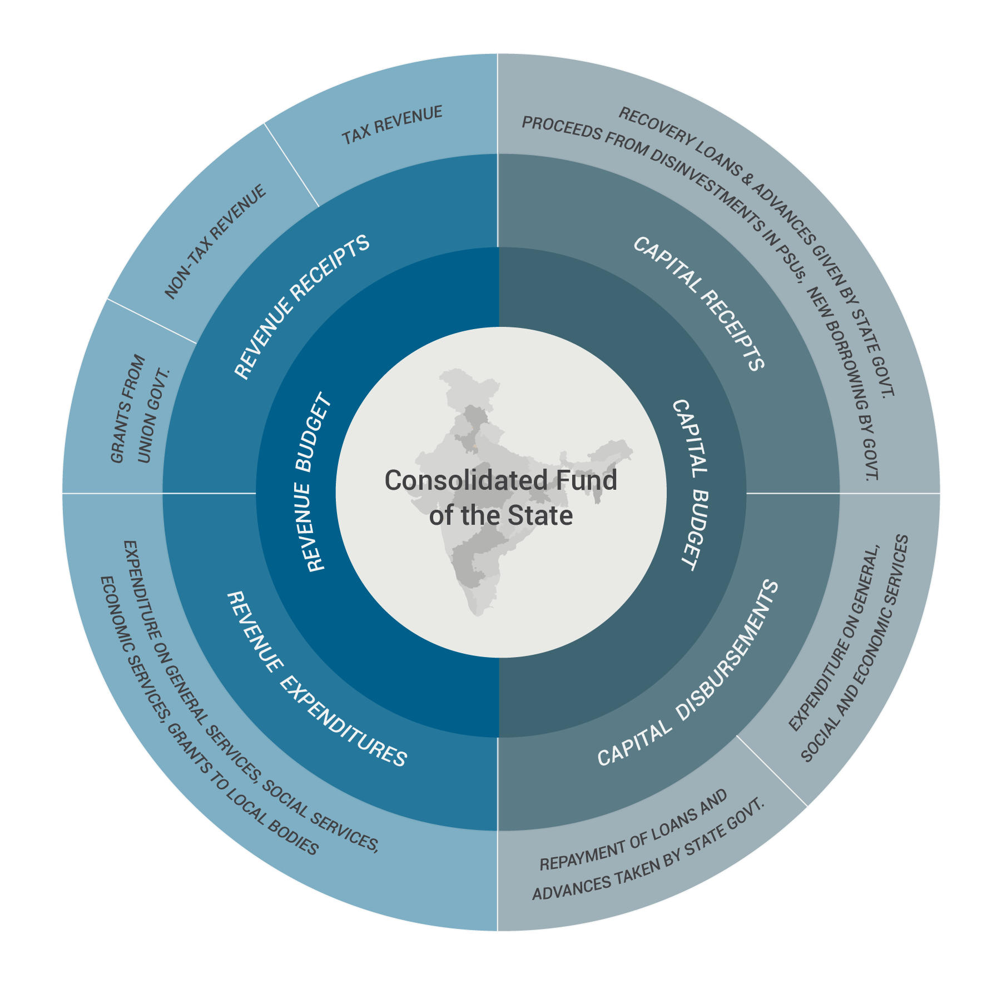
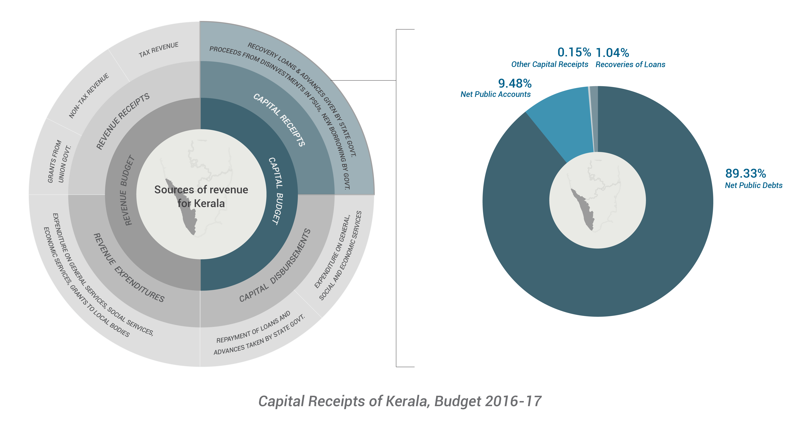
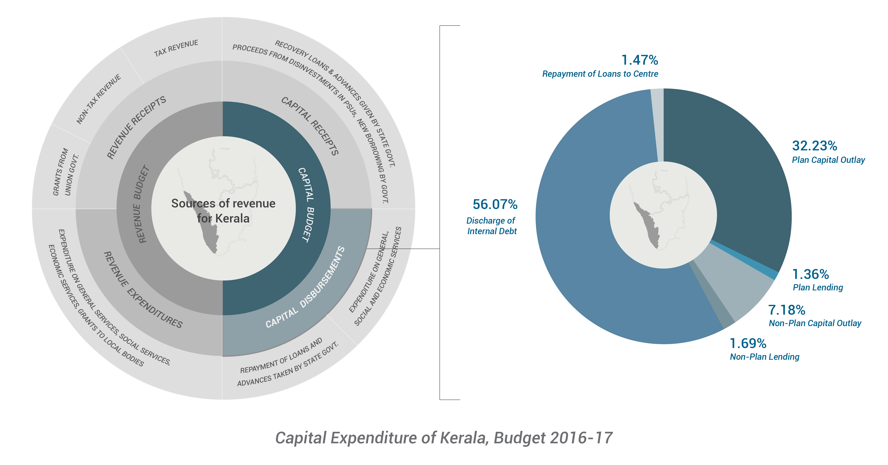

States Budget
=============

The structure of State Government Accounts is quite similar to that of the Union Government, mainly because the provisions of the Constitution with regard to the State Government Budgets are quite similar to those for the Union Budget. For the States also, the Constitution provides that no expenditure can be incurred from the Consolidated Fund of a State without the authority of Appropriation Act, and to obtain this authorisation from State Legislature, a statement of anticipated receipts and expenditure for each financial year needs to be laid before the State Legislature.

The most relevant budget documents for the states are:

* Budget at a Glance 
* Budget Summary 
* Budget Outline (Finance Secretary’s Memorandum)
* Detailed Demands for Grants / Detailed Budget Books 

Heads of Account 
----------------

This represents a 6-step classification as follows:

* Major Heads
* Sub-major Heads
* Minor Heads
* Sub-minor Heads
* Detailed Heads
* Object Heads

Format of the Detailed Demands for Grants
-----------------------------------------

.. image:: images/demand_grant_form.jpg

From 2017-18 onwards, there are plans to do away with the Plan, Non-Plan distinction by several state governments.

The structure of the state budget is as follows:

Receipts
--------

The Receipts structure of a State Budget is slightly different from that of a Union Budget. It consists of tax and non-tax revenues collected by the state, the share of Central Taxes shared with the state as mandated by the Finance Commission, Central Assistance for State and Central Annual Plans as well as Borrowings.

.. image:: images/kerela_chart3.png

*Source: Kerala Budget, 2016-17, Others include Recoveries of Loans and Other Receipts.*

Revenue Receipts
~~~~~~~~~~~~~~~~

Revenue Receipts consists of those sources of revenues which are recurring in nature. Tax and Non-tax revenues, grants-in-aid from the Union Budget recur annually.

Tax Revenue
~~~~~~~~~~~

The major sources of Kerala’s tax revenue apart from the Finance Commission-mandated share from the Centre are Sales Tax/Value Added Tax (VAT), Stamps and Registration Duty, Motor Vehicles Tax and State Excise Duty.

.. image:: images/kerela_chart4.png

*Source: Kerala Budget, 2016-17, Others include taxes on goods and passengers, taxes and duties on electricity & Other Taxes and Duties.*

**Sales Tax/VAT:** Sales Tax/VAT is levied on the sale of a commodity, which is produced/imported and sold for the first time. If the product is sold subsequently without being processed further, it is exempted from sales tax. In India, Sales Tax used to be levied under the authority of both the Central Legislation (Central Sales Tax) and State Governments’ Legislations (Sales Tax) before the introduction of VAT. The proposed Goods and Services Tax (GST) is expected to subsume VAT.

**Stamps and Registration Duty:** Duty charged on the sale and transfer of property is referred to as Stamp Duty and is a major source of tax revenue for most states.

**State Excise Duty:** Unlike the Union Excise Duty or CENVAT, the State Excise Duty is charged on alcohol and related products, narcotics, etc. It is yet another type of tax which is mooted to be included under the GST.

**Motor Vehicles Tax:** It is a tax levied on every motor vehicle by the state under the respective State Motor Vehicles Taxation Act which in Kerala’s case is the Kerala Motor Vehicles Taxation Act, 1976. The state government has the power to increase or decrease the rate of tax from time to time.

Non-Tax Revenue
~~~~~~~~~~~~~~~

Non-tax Revenue refers to sources of revenue which are outside the purview of what is levied on wealth, income or property. States that are rich in natural resources tend to raise revenues from non-tax sources like mining minerals and metals, etc. Other main sources are Interest Receipts, Dividends and Profits from State Public Sector Enterprises as well as returns from user charges on general, social and economic services.

.. image:: images/kerela_chart5.png

*Source: Kerala Budget 2016-17*

In Kerala’s case, non-tax revenue sources are comparatively small. It is not rich in petroleum or petrol products or known for mining of precious metals, neither are state Public Sector Units performing in terms of dividends and profits. 

**Interest Receipts** consist of those from commercial undertakings of state departments, that which is realised from investment of cash balances, co-operative societies, on arrears of forest revenues, etc.

Majority of Non-Tax Revenues of Kerala comes from rendering of Miscellaneous General Services like Police and Other Administrative Services. Economic Services include those on agriculture and allied activities, irrigation, etc. while Social and Community Services are those on Medical and Public Health, Education, Labour and Employment, etc. 

Transfers from the Centre
-------------------------

What is the Role of the Finance Commission?
~~~~~~~~~~~~~~~~~~~~~~~~~~~~~~~~~~~~~~~~~~~

The constitutional arrangements generally result in an asymmetry between ability to raise resources and spending between the three tiers of government. Hence, a Finance Commission is set up once in every five years to suggest sharing of financial resources between the Centre and the States, a major part of which pertains to the sharing of revenue collected through the Central Tax System. At present, the total amount of revenue collected from all Central taxes – excluding the amount collected from Cesses, Surcharges and taxes of Union Territories, and an amount equivalent to the cost of collection of central taxes – is considered as the shareable/divisible pool of Central tax revenue. It consists of taxes like Corporation Tax, Income Tax, the erstwhile Wealth Tax, Customs, Union Excise Duties, etc. In the recommendation period of the 14th Finance Commission (from 2015-16 to 2019-20), 42% of the shareable/divisible pool of Central tax revenue is transferred to States every year and the Centre retains the remaining amount for the Union Budget.

The vertical tax devolution so determined is shared horizontally between states using the modified Gadgil-Mukherjee formula. The modified Gadgil-Mukherjee formula consists of four criteria on the basis of which the funds are distributed between states: 
* Population
* Demographic Change
* Income Distance
* Area and Forest Cover

The total Union Transfers consist of those determined by the Finance Commission prior to the formulation of the Union or State Budgets and those determined at the discretion of the Central Government in power. Here, we take the case of Kerala to see how the fund transfer takes place for the year 2016-17 Budget Estimates.

.. image:: images/kerela_chart6.png

*Source: Kerala Budget, 2016-17*

The ‘State’s Share of Central Taxes’ (devolution), as mentioned earlier, is 42% of the total taxes and duties collected by the Centre. As a percentage of total horizontal transfers between states, it is 2.5%. It is the largest component of the total transfers from the Union to the Kerala state budget. 

The ‘Post-Devolution Revenue Deficit Grant’ is also determined by the 14th Finance Commission prior to the formulation of Union or state budgets and is unique to Kerala. It is a two-time grant for the years 2015-16 and 2016-17 to deal with Kerala’s burgeoning revenue deficit under the ‘Distribution of Revenues’ order. The third component, ‘Local Bodies Grant’ is determined under Article 275(1) of the Constitution and consists of grants to both urban and rural local bodies. These three components together consist of the constitutionally determined transfers from the Union to the State governments. The rest are determined by the Central government at its discretion.

But the State’s share of central taxes is transferred outside of the Union Budget while the other two components are accounted for in the Expenditure Budget of the Union government.

As the diagram shows, the second largest transfer from the Centre to the states after the devolution of central taxes is the ‘Grants for Centrally Sponsored Schemes’. The Centre also determines the grants to the Central and State Plans.

Capital Receipts
----------------

Capital Receipts consist of those revenue sources which are one-time receipts.

*Source: Kerala Budget, 2016-17*

Almost 90% of capital receipts of Kerala come from borrowing and other liabilities in the form of net public debt. Receipts from the Public Account, Recoveries of Loans and other sources are small in comparison.

Revenue Expenditure
-------------------

Revenue Expenditure consists of those expenditures which are recurring in nature.

.. image:: images/kerela_chart8.png

*Source: Kerala Budget, 2016-17. Others include ‘others’ in table and Wages, Office Expenses, Travel Allowances, Motor Vehicles, Rent, Petroleum, Oil & Lubricant, Maintenance, Materials & Supplies, Machinery & Equipment, Minor Works, Major works, Investment)*

Upto 75% of expenditure of Kerala goes into Salaries, Interest Payments and Pensions all of which are recurring in nature and hence tallied under ‘Revenue Expenditure’.

Capital Expenditure
-------------------

The following pie-chart depicts the heads of heads of capital expenditure for Kerala in 2016-17.

*Source: Kerala Budget, 2016-17*

56% of Capital Expenditure of Kerala goes into discharging internal debt and around 32 % is spent as part of the Capital Outlay on Plan spending.
