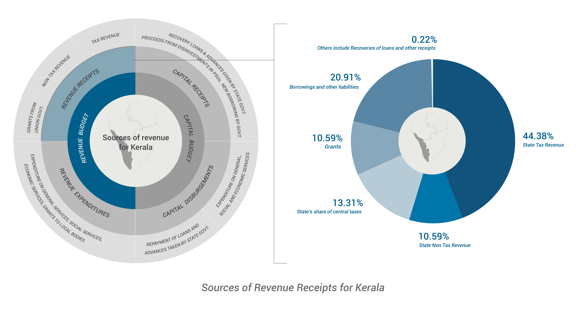
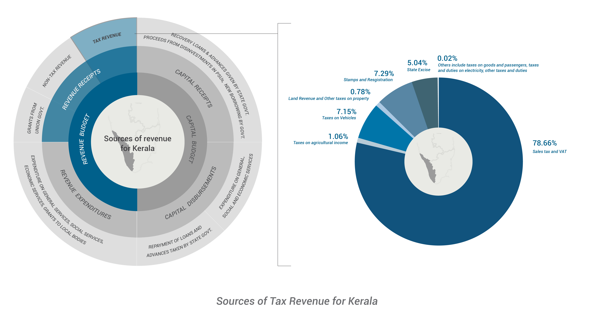
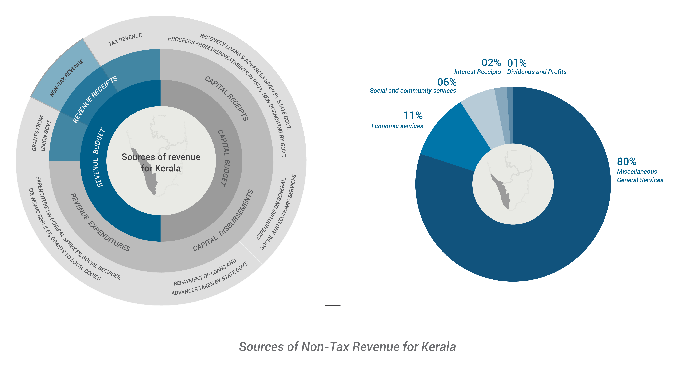
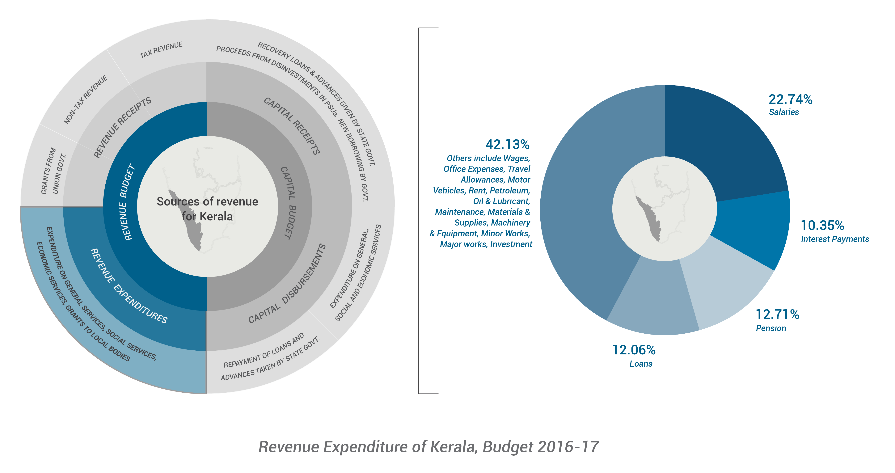

States Budget
=============

The structure of State Government Accounts is quite similar to that of the Union Government. For the States also, the Constitution of India stipulates that no expenditure can be incurred from the Consolidated Fund of a State without the authority of Appropriation Act. And in order to obtain this authorisation from State Legislature, a statement of anticipated receipts and expenditure for each financial year needs to be laid before the State Legislature.

Some of the most relevant budget documents for the states are:

* Budget Speech 
* Budget at a Glance/Budget Summary 
* Detailed Demands for Grants / Detailed Budget Books 

Structure of Budgets in the State
----------------------------------

In the government budgeting system followed in India, a complex system of budget codes/ budget heads is used for reporting disbursements and receipts in the Union and state budgets. This system was last revised by the Comptroller & Auditor General (CAG) of India in 1987. All State Governments and the Union Government are required to follow this system of reporting, which is similar across all States up to a large degree of disaggregation, though not completely similar across different States. 

Heads of Account 
----------------

This represents a 6-tier classification of budgets to record and classify the receipts and expenditure relating to functions of the government. The tiers are as follows:

* Major Heads
* Sub-major Heads
* Minor Heads
* Sub-minor Heads
* Detailed Heads
* Object Heads

Format of the Detailed Demands for Grants
-----------------------------------------

.. image:: images/demand_grant_form.jpg

From 2017-18 onwards, there are plans to do away with the Plan, Non-Plan distinction by several state governments.

The structure of the state budget is as follows:

.. image:: images/state_budget_structure.png

Receipts
--------

The structure of Receipts of a State Budget is slightly different from that of a Union Budget. It consists of tax and non-tax revenues collected by the state, the share of Central Taxes shared with the state as mandated by the Finance Commission, Central Assistance State Annual Plans as well as Borrowings.

For illustration, we take the case of Kerala budget 2016-17. 

*Source: Kerala Budget, 2016-17, Others include Recoveries of Loans and Other Receipts.*

Revenue Receipts
~~~~~~~~~~~~~~~~

Revenue Receipts consist of those sources of revenues which are recurring in nature. Tax and Non-tax revenues, grants-in-aid from the Union Budget recur annually.

Tax Revenue
~~~~~~~~~~~

The major sources of Kerala’s tax revenue apart from the Finance Commission-mandated share from the Centre are Sales Tax/Value Added Tax (VAT), Stamps and Registration Duty, Motor Vehicles Tax and State Excise Duty.

*Source: Kerala Budget, 2016-17, 
Note: Others include taxes on goods and passengers, taxes and duties on electricity & Other Taxes and Duties.*

**Sales Tax:** It is generally charged at the point of purchase or exchange of certain taxable goods, charged as a percentage of the total value of the product. In India, Sales Tax used to be levied under the authority of both the Central Legislation (Central Sales Tax) and State Governments’ Legislations (Sales Tax) before the introduction of VAT. 

**Value Added Tax (VAT):** VAT, is a multistage tax, levied only on the ‘value added’ at each stage of a supply chain and not on the entire value of sales. In VAT, taxpayers receive credit for tax already paid on the inputs in earlier stages of the supply chain.

The proposed Goods and Services Tax (GST) is a version of VAT.

**Stamps and Registration Duty:** Duty charged on the sale and transfer of property is referred to as Stamp Duty and is a major source of tax revenue for most states.

**State Excise Duty:** Unlike the Union Excise Duty or CENVAT, the State Excise Duty is charged on alcohol and related products, narcotics, etc.

**Motor Vehicles Tax:** It is a tax levied on every motor vehicle by the state under the respective State Motor Vehicles Taxation Act. The state government has the power to increase or decrease the rate of tax from time to time.

Non-Tax Revenue
~~~~~~~~~~~~~~~

Non-tax Revenue refers to sources of revenue which are outside the purview of what is levied on wealth, income or property. States that are rich in natural resources tend to raise revenues from non-tax sources like mining minerals and metals, etc. Other main sources are Interest Receipts, Dividends and Profits from State Public Sector Enterprises as well as returns from user charges on general, social and economic services.

*Source: Kerala Budget 2016-17*

In Kerala’s case, non-tax revenue sources are comparatively small. It is not rich in petroleum or petrol products or known for mining of precious metals, neither are state Public Sector Units performing in terms of dividends and profits. 

Majority of Non-Tax Revenues of Kerala comes from carrying out Miscellaneous General Services like Police and Other Administrative Services.

Transfers from the Centre
-------------------------

Grants from the Central Finance Commission
~~~~~~~~~~~~~~~~~~~~~~~~~~~~~~~~~~~~~~~~~~~

The constitutional arrangements generally result in an asymmetry between ability to raise resources and spending between the three tiers of government. Hence, a Central Finance Commission is set up once in every five years to suggest sharing of financial resources between the Centre and the States, a major part of which pertains to the sharing of revenue collected through the Central Tax System. At present, the total amount of revenue collected from all Central taxes – excluding the amount collected from Cesses, Surcharges and taxes of Union Territories, and an amount equivalent to the cost of collection of central taxes – is considered as the shareable/divisible pool of Central tax revenue. It consists of taxes like Corporation Tax, Income Tax, the erstwhile Wealth Tax, Customs, Union Excise Duties, etc. In the recommendation period of the 14th Finance Commission (from 2015-16 to 2019-20), 42% of the shareable/divisible pool of Central tax revenue is to be transferred to States every year and the Centre will retain the remaining amount for the Union Budget.

The formula followed by the 14th Finance Commission for horizontal distribution of resources from divisible pool of central taxes is based on the following four criteria: 
* Population of 1971 [17.5 % weight]
* Demographic Change [10 % weight] 
* Area under forest cover [7.5 % weight]
* Area [15 % weight] 
* Income Distance [50% weight]

The total Union Transfers consist of those determined by the Finance Commission (i.e. states’ share in Central taxes and Finance Commission Grants, if any), the Non-Plan Grants and Plan Grants (which include the funds for Centrally Sponsored Schemes). Here, we take the case of Kerala to see how the fund transfer takes place for the year 2016-17 Budget Estimates.

*Source: Kerala Budget, 2016-17*

The ‘State’s Share of Central Taxes’ (devolution), as mentioned earlier, is 42% of the total taxes and duties collected by the Centre. Kerala’s share in the devolution of central taxes is 2.5 % as per the recommendations of the 14th Finance Commission, which accounts for around 55% of the total Union Government transfers to the state. 

The ‘Post-Devolution Revenue Deficit Grant’ is also determined by the 14th Finance Commission prior to the formulation of Union or state budgets, and is awarded to states as per their projected fiscal positions. It is a grant given to deal with the state’s burgeoning revenue deficit under the ‘Distribution of Revenues’ order. The third component, ‘Local Bodies Grant’ is determined under Article 275(1) of the Constitution and consists of grants to both urban and rural local bodies. These three components together consist of the constitutionally determined transfers from the Union to the State government. The rest are determined by the Central government at its discretion.

In this context it should be noted that when allocations of funds are made across Union Ministries/Departments from the Union Budget, the state’s share of Central taxes is kept outside of the purview of expenditures in the Union Budget. But the other two components mentioned above, are accounted for when making these allocations.

As the diagram above shows, the second largest transfer from the Centre to the states after the devolution of central taxes is the ‘Grants for Centrally Sponsored Schemes’.  The Centre determines the grants to the State Plans as a part of the funding for Centrally Sponsored Schemes’ allocations.

Capital Receipts
----------------

As mentioned earlier, Capital Receipts of the government lead to either a reduction in the assets or an increase in the liabilities of the government. Capital Receipts for government need not come periodically in every Budget.

.. image:: images/kerela_chart7.png

*Source: Kerala Budget, 2016-17*

Almost 90% of capital receipts of Kerala come from borrowing and other liabilities in the form of public debt. Receipts from the Public Account, Recoveries of Loans and other sources are small in comparison.

Revenue Expenditure
-------------------

Revenue Expenditure consists of those expenditures which are recurring in nature.

*Source: Kerala Budget, 2016-17. Others include ‘others’ in table and Wages, Office Expenses, Travel Allowances, Motor Vehicles, Rent, Petroleum, Oil & Lubricant, Maintenance, Materials & Supplies, Machinery & Equipment, Minor Works, Major works, Investment*

Up to 75 % of expenditure of Kerala goes into Salaries, Interest Payments and Pensions, which are recurring in nature and hence categorised under ‘Revenue Expenditure’.

Capital Expenditure
-------------------

The following pie-chart depicts the different heads of capital expenditure for Kerala in 2016-17.

.. image:: images/kerela_chart9.png

*Source: Kerala Budget, 2016-17*

56 % of Capital Expenditure of Kerala goes into discharging internal debt and around 32 % is spent as part of the Capital Outlay on Plan spending.
