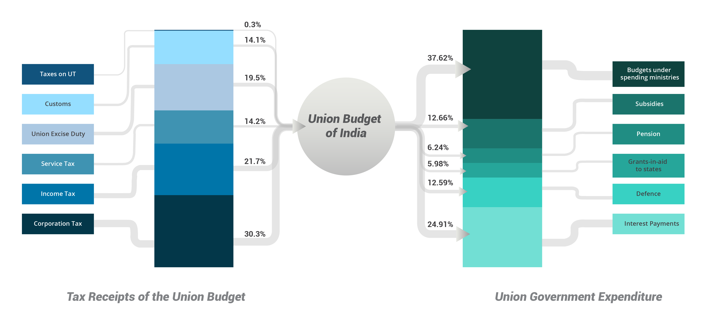

Union Budget
============

.. image:: images/union_budget_structure.png
    :width: 90%

What does an Average Budget Cycle Look Like?
-------------------------------------------

.. image:: images/budget_cycle.png

Preparation of the Budget
-------------------------

By convention, the Union Budget for next financial year is presented in Lok Sabha by the Finance Minister on the last working day of February. This year, however, the date for presentation of the budget has been advanced to the first day of February. The process of budget formulation starts in the last week of August or the first fortnight of September. To get the process started, the Budget Division in the Department of Economic Affairs under the Ministry of Finance issues the annual budget circular to all the Union government ministries/departments around August/September. The Circular contains detailed instructions for these ministries/departments on the form and content of the statement of budget estimates to be prepared by them. 

Earlier, the union ministries would provide estimates for plan expenditure to finalise budget estimates for the next financial year, only after they had discussed their respective plan schemes with the Central Planning Commission. Then the Planning Commission would depend on the Finance Ministry to arrive at the Gross Budgetary Support. This would be provided in the budget for the next annual plan of the Union government. In principle, the size of each annual plan should be derived from the approved size of the overall Five-Year Plan (12th Five-Year Plan, 2012-13 to 2016-17, in the present instance). However, in practice, the size of the gross budgetary support for an annual plan also depends on the expected availability of funds with the finance ministry for the next financial year.

Major Changes in the Offing
---------------------------

Beginning from 2017, this entire process will most likely be advanced by a month and the announcement of the budget will be done on 1st of February.

Further, in 2015 the Central Planning Commission was replaced by the NITI Aayog that has no role in budget formulation. Plan and Non-Plan distinction will also be done away with from 2017 Union Budget onwards. This would be applicable to the Union Budget and at least for some of the state budgets as well.

What are the Union Budget Documents? 
------------------------------------

Article 112 of the Constitution mandates the Union Government to lay before both the Houses of Parliament a statement of receipts and expenditure of the Government of India for that year, referred to as the 'Annual Financial Statement'. The important budget documents are:

* Annual Financial Statement
* Key to Budget Documents 
* Budget Highlights 
* Budget Speech
* Budget at a Glance
* Finance Bill
* Memorandum
* Receipt Budget
* Expenditure Budget
* Customs & Central Excise Notifications
* The Macro Economic Framework Statement 
* The Medium Term Fiscal Policy Statement 
* The Fiscal Policy Strategy Statement 
* Statement of Revenue Foregone 
* Implementation of Budget Announcements 

What are the Categories of Government Accounts?
-----------------------------------------------

There are three major categories of government accounts:

* Consolidated Fund: The Consolidated Fund under Article 266(1) is what is usually known as the budget. It contains all revenues received by the Government, all receipts from recoveries of loans given by the Government, and the entire amount of new loans raised by the Government. All expenditure of the Government is incurred from this Consolidated Fund. And, the Government cannot take out any amount from this without authorisation from Parliament.

* Contingency Fund: The Contingency Fund is constituted under Article 267 of the Constitution of India and is a Rs 500 crores fund which is at the disposal of the President of India. It is for urgent or unforeseen expenditures which do not require prior legislative approval as opposed to the Consolidated Fund. However, the government must get such expenditure approved by the Parliament later. Moreover, with approval of the Parliament, the Government needs to withdraw funds from the Consolidated Fund (equivalent to the amount of expenditure from Contingency Fund) and replenish the Contingency Fund.

* Public Account: The Public Account was constituted under Article 266(1) of the Constitution of India. Certain transactions, other than the normal receipts and expenditure of Government which are reported in the Consolidated Fund, enter Government accounts. Government acts more as a banker in case of these other transactions, for instance, the provident funds, small savings collections, other deposits, etc. The money received from such transactions is kept in the Public Account and the related disbursements are also made from there. Funds kept in the Public Account do not belong to the Government, and the Government needs to pay back this money at some point of time to the persons and authorities who deposited them. Parliamentary authorisation for payments from the Public Account is, therefore, not required.

What are the Components of the Consolidated Fund of India?
----------------------------------------------------------

The Consolidated Fund has Revenue and Capital Account which differ from each other based on assets generated or liabilities incurred. There are expenditures and receipts under both accounts.

**Revenue Account**

This consists of Revenue Expenditure and Revenue Receipts. Any expenditure that doesn’t create assets or reduce liabilities is treated as **Revenue Expenditure**. Examples include salaries, subsidies, interest payments, etc.

Proceeds from taxes, non-tax sources of revenue and other receipts are recorded as **Revenue Receipts**. Income tax, corporation tax, Union excise duty, are some of the sources of tax-revenue, while interest receipts, fees/ user charges, and dividend & profits from government enterprises are some examples of non-tax revenue.

**Capital Account**

Capital Expenditure and Capital Receipts constitute the budget on the Capital Account. Any expenditure incurred for the purpose of creation of assets or reduction of liabilities is recorded as **Capital Expenditure**. 

**Capital Receipts** are those that lead to a reduction in the assets or an increase in the liabilities of the government. Examples include recoveries of loans, earnings from disinvestment and debt. 

Other Ways of Classifying Expenditure
----------------------------------------------------------

In addition to the categories mentioned above, expenditure is also classified into the following categories:

**Plan and Non-Plan Expenditure**

**Plan Expenditure** is meant for financing the schemes and programmes especially framed under the given Plan (the Five Year Plan) or the unfinished tasks of the previous Plans. 

Once a programme or scheme pursued under a specific Plan completes its duration, the maintenance cost and future running expenditures on the assets created or staff recruited are not regarded as Plan Expenditure. 

Any expenditure of the government that does not fall under the Plan Expenditure is **Non-Plan Expenditure**.

**Voted and Charged Expenditure**

Expenditure that has to be authorised by the legislature/parliament is **Voted Expenditure** while that which is automatically debited from the Consolidated Fund of India is called **Charged Expenditure**. E.g.: interest payments, salaries of the President, Lok Sabha speaker, etc. cannot be voted upon in the Parliament.

Money Flow
----------

Where Does the Money Come From?
~~~~~~~~~~~~~~~~~~~~~~~~~~~~~~~

The different sources from which the government can raise resources can be broadly classified into the following: 
* Tax Revenue
* Non-Tax Revenue
* Disinvestments/Borrowings
* Grants-in-Aid

Tax revenue is considered one of the most important sources of revenue for the government. 

For example, in the financial year 2016-17 if the Gross Tax Collection expected by the Centre is Rs. 100, around Rs. 30 is from Corporation Tax, Rs. 21 from Income Tax, Rs. 14 from Customs, Rs. 19.5 from Union Excise Duties and Rs. 14 from Service Tax.

.. image:: images/ub_receipt_budget.png

Upto 52 % of the Union Government’s receipts are from direct tax sources such as Corporation Tax and Income Tax while 48 percent are from indirect sources like Custom Duties, Union Excise Duties and Service Tax. 

Direct Taxes are those for which the burden of tax falls on the entity that is being taxed while Indirect Taxes are those for which tax-burden can be shifted or passed on to others later through business transactions of goods/services. Some examples of Direct Taxes are Corporation Tax, Income Tax, etc., while Indirect Taxes include Customs Duties, Excise Duties, Service Tax, etc.. Of all these taxes, the Union Government has the constitutional responsibility to collect Corporation Tax, Income Tax, Customs Duties, Service Tax and Union Excise Duties.

**Corporation Tax:** 
Levied on incomes of registered companies/corporations in the territory of India (whether national or multinational/foreign). National companies are taxed on the basis of their aggregate income, irrespective of its source and origin whereas foreign companies are taxed only on the income that arises from operations carried out in India.

**Income Tax:** 
This is a tax on the income of individuals, firms, etc. other than Companies, under the Income Tax Act, 1961.

**Union Excise Duty:** 
A production tax imposed on goods manufactured in India for domestic consumption by the Union Government under the Central Excise Act, 1944 and the Central Excise Tariff Act. From 1999 onwards, it has been called the Central Value Added Tax (CENVAT). Certain goods like alcohol and related products as well as narcotics substances are included under the State Excise Duty and collected by all states.

**Service Tax:**
Levied on services provided by an entity and the responsibility of payment of tax lies on the service provider.
The Goods and Service Taxes (GST) to be implemented in 2017 includes both Excise Duties and Service Taxes.

Where Does the Money Go?
~~~~~~~~~~~~~~~~~~~~~~~~

If the Union Budget has a total allocation of Rs. 100 in the financial year 2016-17, this is how the government intends to spend that money.

.. image:: images/ub_exp_budget.png

**Interest Payments** include interest paid on internal debt like Treasury Bills, Market Loans, securities issued against small savings collection, state provident funds and insurance and pension funds.

**Defence** includes expenditure incurred on various aspects of the Army, Navy and Air Force in terms of miscellaneous services like Rashtriya Rifles, J&K Light Infantry, Coast Guard and Research and Development; revenue expenditures like pay and allowances, transportation, stores; and capital outlay on construction, air craft and aero engine, vehicles, equipment, naval fleet and dockyards, etc. This does not include defence pension which is calculated separately under the allocation for pension.

**Pension** consist of the provision for pensions and other retirement benefits of retired personnel of Defence Services and other civil departments including pensionary benefits of the employees of the Department of Telecommunications together with employees absorbed in Bharat Sanchar Nigam Ltd., and for medical treatment of CGHS pensioners. This does not include expenditure on social security measures for widows, mothers, aged and persons with disabilities. 

**Subsidies** include subsidies on food, fertiliser, petrol and petroleum products, interest subsidies, etc.

**Grants-in-Aid** are provided from a higher tier of government to a lower tier. In this case it is provided by the union government to the states. It is different from loans since these are provided without the expectations of any repayment later on.

Fiscal Deficit
--------------

Fiscal Deficit refers to a gap in government’s budget that arises in any financial year when the government’s total expenditure exceeds its total receipts in that year and consequently it borrows money to cover that gap. The additional resources raised by the government in a financial year, in order to meet this gap, is the fiscal deficit for that year. Unlike budgets of individuals or households (where income determines expenditure), in the government’s budget it’s the expenditure commitments that should determine its income (i.e. tax revenue and other receipts, which don’t have to be repaid) and the amount to be borrowed (if needed). It is covered by borrowing. However, the total borrowing or debt taken by the government in a financial year could be more than the level of the Fiscal Deficit; this is because some of the financial liabilities (or amounts that have to be repaid) under government designed mechanisms like National Small Savings Fund (NSSF) and Market Stabilization Scheme (MSS) do not come under Fiscal Deficit (as those mechanisms operate outside the government budget) but those are considered to be the government’s liabilities or debt. The Central and State Governments in India both finance their deficits mostly through borrowing from domestic sources. 
